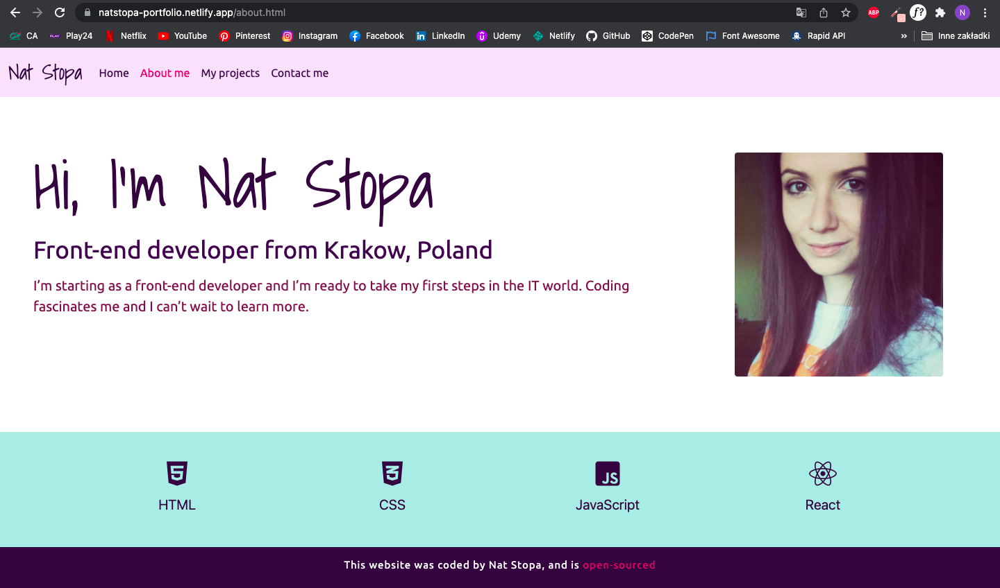

# portfolio-project
### I created a portfolio page to show my skills and projects.

## This web page is hosted here!
 https://natstopa-portfolio.netlify.app/
 
## Table of Contents
* [Technologies Used](#technologies-used)
* [Screenshots](#screenshots)
* [Sources](#sources)
* [Author](#author)

## Technologies Used
* HTML5
* CSS3
* Bootstrap v5.1
* Grid
 
## Screenshots

## Sources
* Fonts: Shadows Into Light, Ubuntu [Google Fonts](https://fonts.google.com)
* Icons: [Font Awesome](https://fontawesome.com/)
* Design by me
>This Website is made for [SheCodes Responsive Course](https://www.shecodes.io/responsive) 

## Author
Created by [Nat Stopa](https://natstopa-portfolio.netlify.app/)
